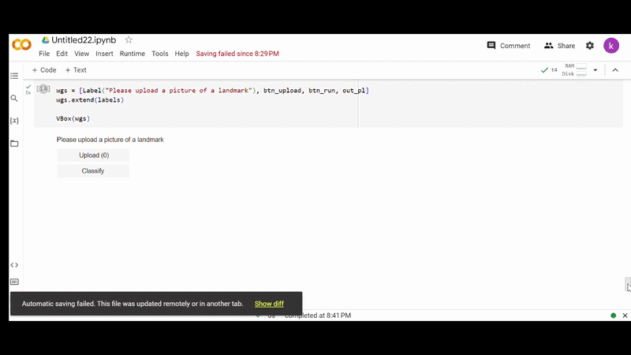

#  Landmark Classification and Social Media Tagging


##  Overview

This project focuses on building a deep learning-based computer vision system to classify landmark images using PyTorch. The objective is to accurately identify landmark categories by developing a custom Convolutional Neural Network (CNN), applying transfer learning, and deploying the trained model as a lightweight web application for image prediction.

The project demonstrates an end-to-end image classification pipeline, including data preprocessing, data augmentation, model training, evaluation, performance optimization, and model deployment.

---

##  Objective
To build a robust image classification system that can:
- Identify landmark categories from images
- Improve generalization using data augmentation
- Compare CNN vs Transfer Learning approaches
- Enhance accuracy using pretrained deep learning models

---

##  Tech Stack
- Python
- PyTorch
- NumPy
- Matplotlib
- OpenCV
- Deep Learning (CNN)
- Computer Vision
- Transfer Learning (ResNet18)
- Data Augmentation

---

##  Approach

### 1. Custom CNN Model (From Scratch)
- Built a convolutional neural network using PyTorch
- Architecture includes convolutional layers, max pooling, batch normalization, and dropout
- Designed for feature extraction from landmark images
- Reduced overfitting using regularization techniques

---

### 2. Data Augmentation
To improve model generalization:
- Random rotation
- Horizontal flipping
- Color jittering

This improved robustness on unseen real-world images.

---

### 3. Transfer Learning (ResNet18)
- Used pretrained ResNet18 (ImageNet weights)
- Fine-tuned for landmark classification
- Improved feature extraction and model performance
- Achieved significantly higher accuracy compared to custom CNN

---

##  Results

| Model | Accuracy | Approach |
|------|---------:|---------|
| Custom CNN | ~60% | Built from scratch |
| ResNet18 | 75%+ | Transfer learning |

✔ Transfer learning significantly improved performance  
✔ Reduced overfitting and improved generalization  

---


##  Project Structure

```
Landmark-Classification-and-Tagging-for-Social-Media/
│
├── src/
│   ├── __init__.py
│   ├── create_submit_pkg.py
│   ├── data.py
│   ├── helpers.py
│   ├── model.py
│   ├── optimization.py
│   ├── predictor.py
│   ├── train.py
│   └── transfer.py
│
├── app.ipynb
├── cnn_from_scratch.ipynb
├── transfer_learning.ipynb
├── requirements.txt
├── landmark-classification-demo.gif
└── README.md
```

---


## 📦 Dependencies

This project uses the following libraries:

```txt
opencv-python-headless==4.5.3.56
matplotlib==3.4.3
numpy==1.21.2
pillow==7.0.0
bokeh==2.1.1
torch==1.9.0
torchvision==0.10.0
tqdm==4.63.0
ipywidgets==7.6.5
livelossplot==0.5.4
pytest==7.1.1
pandas==1.3.5
seaborn==0.11.2
```

---
##  Key Learnings
- Building CNN architectures from scratch using PyTorch
- Importance of data augmentation in computer vision
- Transfer learning for performance improvement
- Model evaluation and optimization techniques
- Practical experience in image classification pipelines

---
## 🎥 Demo

A short demonstration of the model inference workflow:


